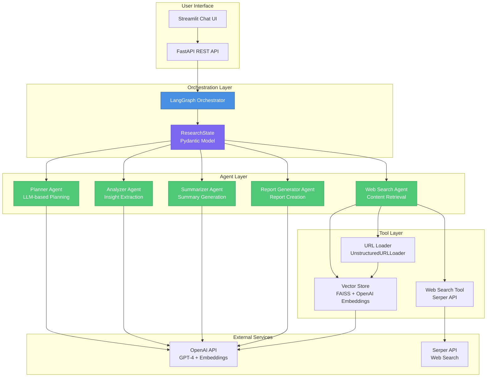
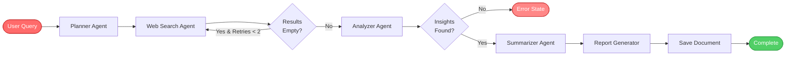

# 🔍 AI Research Orchestrator

A multi-agent AI system that automates comprehensive research workflows. Given a research query, the orchestrator intelligently plans, searches, analyzes, summarizes, and generates structured research reports using a coordinated team of specialized AI agents.

## 🎯 Core Idea

The AI Research Orchestrator breaks down complex research tasks into a **multi-stage pipeline** where specialized agents collaborate:

1. **Planner Agent** → Decomposes the query into research topics, search queries, and analysis steps
2. **Web Search Agent** → Retrieves relevant content from the web and indexes it into a vector store
3. **Analyzer Agent** → Extracts key findings, evidence, and insights from the retrieved content
4. **Summarizer Agent** → Creates a concise academic-style summary
5. **Report Generator Agent** → Produces a comprehensive, structured markdown report

The system uses **LangGraph** for orchestration, enabling conditional routing, retry logic, and state management across the pipeline. All agents share a common state object that flows through the graph, allowing each agent to build upon previous work.

## 🏗️ Architecture

### System Architecture Diagram



### Workflow Diagram



## 🛠️ Tech Stack

- **Language**: Python 3.11+
- **Orchestration**: LangGraph (stateful multi-agent workflows)
- **API Framework**: FastAPI
- **LLM**: OpenAI API (GPT-4 for agents, text-embedding-3-small for embeddings)
- **Vector Store**: FAISS (in-memory similarity search)
- **Web Search**: Serper API (Google search results)
- **Content Extraction**: LangChain UnstructuredURLLoader
- **State Management**: Pydantic models
- **UI**: Streamlit (conversational chat interface)
- **Logging**: Centralized logging to console and `logs/runing_logs.log`

## 📁 Project Structure

```
AI_Orchestra/
├── app/
│   ├── __init__.py          # Logging configuration
│   ├── main.py              # FastAPI endpoints
│   ├── orchestrator.py      # LangGraph orchestration logic
│   ├── state.py             # ResearchState Pydantic model
│   ├── llm.py               # OpenAI LLM wrapper
│   ├── agents/
│   │   ├── planner.py       # Breaks query into structured tasks
│   │   ├── search_agent.py  # Web search + content extraction
│   │   ├── analyzer.py      # Extracts insights from content
│   │   ├── summarizer.py    # Generates concise summary
│   │   └── report_generator.py  # Creates structured markdown report
│   └── tools/
│       ├── web_search.py    # Serper API integration
│       ├── url_loader.py    # UnstructuredURLLoader wrapper
│       └── vector_store.py # FAISS vector store with OpenAI embeddings
├── app.py                   # Streamlit UI entrypoint
├── requirements.txt         # Python dependencies
├── .env                     # Environment variables (API keys)
├── logs/
│   └── runing_logs.log      # Application logs
└── output/                  # Generated markdown reports
```

## 🚀 Quick Start

### 1. Installation

```bash
# Create virtual environment
python -m venv env

# Activate virtual environment
# Windows PowerShell:
.\env\Scripts\Activate.ps1
# Windows CMD:
.\env\Scripts\activate.bat
# Linux/Mac:
source env/bin/activate

# Install dependencies
pip install -r requirements.txt
```

### 2. Environment Setup

Create a `.env` file in the project root:

```bash
OPENAI_API_KEY=sk-your-openai-key-here
SERPER_API_KEY=your-serper-api-key-here
# Optional: override default model
# OPENAI_MODEL=gpt-4o
```

### 3. Run the Streamlit UI

```bash
streamlit run app.py
```

Open your browser to `http://localhost:8501` and start asking research questions!

### 4. Run the FastAPI Server (Alternative)

```bash
uvicorn app.main:app --reload
```

The API will be available at `http://127.0.0.1:8000`.

**API Endpoints:**
- `GET /health` - Health check
- `POST /research` - Run research orchestration

**Example Request:**
```json
{
  "query": "Explain the current state of research on retrieval-augmented generation."
}
```

## 🔄 How It Works

### 1. **Planner Agent**
- Takes the user query
- Uses LLM to generate:
  - `research_topics`: List of topics to explore
  - `search_queries`: Optimized search queries
  - `analysis_steps`: Steps for analysis

### 2. **Web Search Agent**
- Executes search queries using Serper API
- Retrieves URLs and metadata
- Uses `UnstructuredURLLoader` to extract full page content
- Indexes content into FAISS vector store for future RAG

### 3. **Analyzer Agent**
- Processes search results
- Extracts structured insights:
  - `finding`: Key finding or claim
  - `evidence`: Supporting evidence
  - `source`: Source URL/title

### 4. **Summarizer Agent**
- Synthesizes extracted insights
- Generates a 300-500 word academic-style summary
- Neutral tone, structured paragraphs

### 5. **Report Generator Agent**
- Creates comprehensive markdown report with sections:
  1. Introduction
  2. Background
  3. Key Findings
  4. Trends
  5. Challenges
  6. Conclusion
  7. References
- Saves report to `output/{query}.md`

### Conditional Logic

- **Search Retry**: If `search_results` is empty and `search_attempts < 2`, retry search
- **Error Handling**: If `extracted_insights` is empty, mark error state and stop

## 📊 State Management

The `ResearchState` Pydantic model flows through all agents:

```python
class ResearchState(BaseModel):
    user_query: str
    research_topics: List[str]
    search_queries: List[str]
    analysis_steps: List[str]
    search_results: List[dict]      # {title, source, content, url}
    extracted_insights: List[dict]   # {finding, evidence, source}
    summary: str
    final_report: str
    status: str                      # pending|running|completed|error
    error: Optional[str]
    search_attempts: int
```

## 📝 Logging

All operations are logged to:
- **Console**: Real-time output with timestamps
- **File**: `logs/runing_logs.log` (UTF-8 encoded)

Log format: `[YYYY-MM-DD HH:MM:SS]: message`


```bash
# Test web search functionality
python -m trail.test_web_search "your query here"
```

## 🔧 Configuration

### Vector Store
- **Embedding Model**: `text-embedding-3-small` (1536 dimensions)
- **Index Type**: FAISS `IndexFlatIP` (Inner Product for cosine similarity)
- **Storage**: In-memory (not persisted to disk)

### LLM Models
- **Default**: `gpt-4o` (configurable via `OPENAI_MODEL` env var)
- **Embeddings**: `text-embedding-3-small`

## 📄 Output

Generated reports are saved as markdown files in the `output/` directory:
- Filename: Sanitized version of the user query
- Format: Structured markdown with sections
- Encoding: UTF-8

## 🤝 Contributing

This is a research project demonstrating multi-agent orchestration with LangGraph. Feel free to extend it with:
- Additional agents (e.g., fact-checker, citation validator)
- Persistent vector store (save/load FAISS index)
- More sophisticated retry logic
- Real-time progress updates in UI
- Voice input integration

## 📜 License

See `LICENSE` file for details.

## 🙏 Acknowledgments

- **LangGraph** for orchestration framework
- **OpenAI** for LLM and embeddings
- **Serper** for web search API
- **FAISS** for efficient vector similarity search
